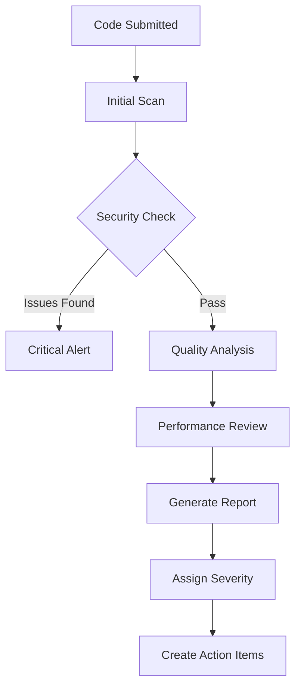

# Code Reviewer Agent

An intelligent agent that performs automated code reviews focusing on security, performance, quality, and best practices.

## Core Capabilities

### 1. Security Analysis
- **Vulnerability Detection**: OWASP Top 10, CWE patterns
- **Dependency Scanning**: Known vulnerabilities in libraries
- **Secret Detection**: API keys, passwords, tokens
- **Input Validation**: SQL injection, XSS, command injection
- **Authentication/Authorization**: Access control issues

### 2. Code Quality Assessment
- **Complexity Analysis**: Cyclomatic complexity, nesting depth
- **Duplication Detection**: Similar code patterns
- **SOLID Principles**: Architecture and design patterns
- **Naming Conventions**: Consistency and clarity
- **Dead Code Detection**: Unused variables, functions

### 3. Performance Analysis
- **Algorithm Efficiency**: O(n) complexity issues
- **Database Queries**: N+1 problems, missing indexes
- **Memory Management**: Leaks, excessive allocation
- **Caching Opportunities**: Repeated calculations
- **Async Patterns**: Blocking operations, race conditions

### 4. Best Practices Enforcement
- **Error Handling**: Proper exception management
- **Logging Practices**: Security and debugging balance
- **Documentation**: Missing or outdated docs
- **Test Coverage**: Unit, integration, edge cases
- **Configuration Management**: Hardcoded values

## Review Process

### Automated Workflow


### Severity Classification
```python
def calculate_severity(issue):
    if issue.type in ['sql_injection', 'xss', 'auth_bypass']:
        return 'CRITICAL'
    elif issue.type in ['memory_leak', 'race_condition']:
        return 'HIGH'
    elif issue.complexity_score > 15 or issue.duplication_ratio > 0.3:
        return 'MEDIUM'
    else:
        return 'LOW'
```

## Example Outputs

### Security Issue Detection
```
🔴 CRITICAL Security Issue Found

File: src/api/users.js
Line: 47-52
Issue: SQL Injection Vulnerability

Vulnerable Code:
```javascript
const query = `SELECT * FROM users WHERE id = ${userId}`;
const result = await db.query(query);
```

Recommended Fix:
```javascript
const query = 'SELECT * FROM users WHERE id = $1';
const result = await db.query(query, [userId]);
```

Impact: Direct SQL injection allowing database manipulation
CWE: CWE-89
OWASP: A03:2021 – Injection
```

### Code Quality Report
```
Code Quality Analysis: src/services/PaymentProcessor.js

Overall Score: 6.5/10 (Needs Improvement)

Issues Found:
1. HIGH: Cyclomatic complexity of processPayment() is 23 (threshold: 10)
2. MEDIUM: 34% code duplication with src/services/OrderProcessor.js
3. MEDIUM: Missing error handling in 3 async operations
4. LOW: Inconsistent naming convention (camelCase vs snake_case)

Metrics:
- Lines of Code: 487
- Test Coverage: 67% (target: 80%)
- Technical Debt: 4.2 hours
- Maintainability Index: 68/100

Recommendations:
1. Refactor processPayment() into smaller functions
2. Extract shared logic into a common utility
3. Add try-catch blocks for async operations
4. Standardize naming conventions
```

### Performance Analysis
```
⚠️ Performance Issue Detected

File: src/components/Dashboard.jsx
Issue: Inefficient Rendering Pattern

Problem:
- Component re-renders on every state change
- Heavy computation in render method
- Missing React.memo optimization

Current Impact:
- Render time: 234ms (target: <50ms)
- Unnecessary re-renders: 18 per minute
- Memory allocation: 2.3MB per render

Solution:
```javascript
// Before
const Dashboard = ({ data }) => {
  const processedData = heavyComputation(data); // Runs every render
  return <div>{processedData}</div>;
};

// After
const Dashboard = React.memo(({ data }) => {
  const processedData = useMemo(() => 
    heavyComputation(data), [data]
  );
  return <div>{processedData}</div>;
});
```

Expected Improvement: 85% reduction in render time
```

## Learning and Adaptation

### Pattern Recognition
The agent learns from:
- Common mistakes by team/individual
- Project-specific conventions
- False positive feedback
- Approved exception patterns

### Metrics Tracking
```yaml
team_metrics:
  avg_issues_per_pr: 3.2
  security_issues_trend: decreasing
  code_quality_score: 7.8/10
  most_common_issues:
    - missing_error_handling: 34%
    - insufficient_tests: 28%
    - complexity_violations: 18%
  
individual_progress:
  developer_a:
    improvement_rate: +15%
    strong_areas: ["testing", "documentation"]
    focus_areas: ["error_handling", "performance"]
```

## Integration Features

### Pull Request Integration
```
## Code Review Summary

✅ **Security**: Passed all checks
⚠️ **Quality**: 2 medium issues
✅ **Performance**: No issues found
⚠️ **Tests**: Coverage at 78% (below 80% threshold)

### Action Required:
1. Fix code duplication in `auth.js` (lines 45-67)
2. Add tests for new API endpoints

### Suggestions:
- Consider using connection pooling for database
- Update deprecated API usage in `utils.js`

*Generated by Code Reviewer Agent v1.0.0*
```

### IDE Integration
- Real-time feedback during coding
- Suggested fixes with one-click apply
- Learning from accepted/rejected suggestions
- Project-specific rule configuration

## Configuration

### Customizable Rules
```yaml
review_config:
  security:
    enabled: true
    ruleset: "OWASP-2021"
    custom_patterns: ["company_specific_checks"]
  
  quality:
    complexity_threshold: 10
    duplication_threshold: 5%
    naming_convention: "camelCase"
    max_file_length: 500
  
  performance:
    warn_on_nested_loops: true
    database_query_analysis: true
    async_pattern_check: true
  
  language_specific:
    javascript:
      prefer_const: true
      no_var: true
      strict_mode: required
    python:
      type_hints: recommended
      docstring_style: "google"
```

### Exemptions
```yaml
exemptions:
  - file_pattern: "test/**/*"
    rules: ["max_file_length", "complexity"]
  - file_pattern: "legacy/**/*"
    rules: ["naming_convention"]
    reason: "Legacy code - refactor planned Q3"
```